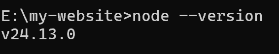
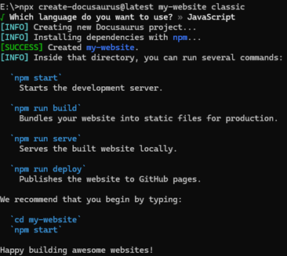
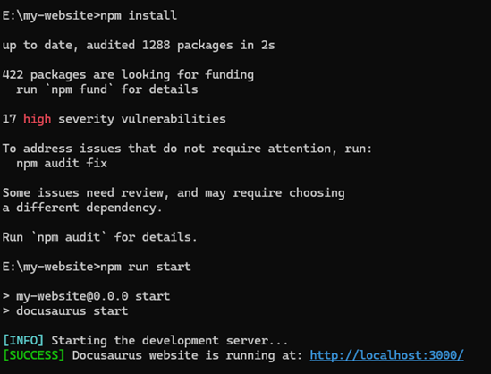
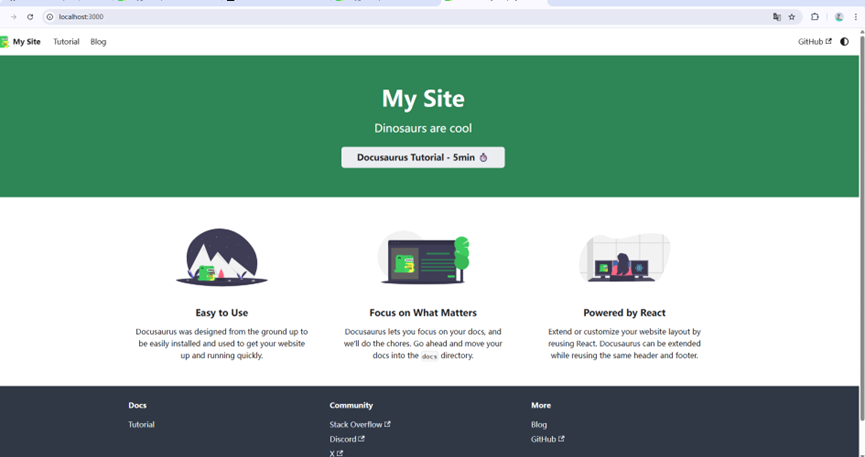

# docusaurus使用基础教程
Docusaurus 是由 Meta 开源的一款现代化静态网站生成器，专为构建高效、美观的技术文档网站而设计。它基于 React 技术栈，允许开发者使用简单的 Markdown 编写内容，并快速生成具备文档系统、博客、自定义页面等核心功能的网站，同时内置了多语言支持、版本管理、响应式设计和搜索功能。其显著优点在于开箱即用的配置、出色的性能和 SEO 优化、活跃的维护与丰富的插件生态，让团队能专注于内容创作而非底层技术。然而，它的主要缺点是对 React 技术栈的强依赖，这给不熟悉前端生态的团队带来了一定学习门槛，且深度界面定制需要较高的前端开发能力。总体而言，Docusaurus 是构建专业技术文档、开源项目主页和知识库的高效平衡之选，尤其适合追求现代化体验且有一定前端基础的团队。
## 安装docusaurus
#### 安装node 
- 必须是Node.js v16.14 或以上版本（你可以运行 node -v命令查看版本号）。
- node.js下载方法https://nodejs.org/en/download/, 安装 Node.js 时，建议勾选所有和依赖相关的选项。
  


#### 安装docusaurus
在你想要的路径下
```bash
npx create-docusaurus@latest my-website classic
```

#### 更新插件&启动
```bash
cd my-website
npm install
npm run start
```


初始化完成！



##  建立远程github仓库

##  编写你的第一个文件
##  部分配置项介绍